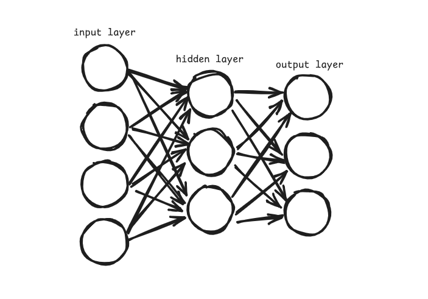

# Multilayer Perceptron in Go
#### I built a multilayer perceptron in golang from scratch just to show how easy it is.

## But what the heck is a multilayer perceptron, anyway?

A multilayer perceptron, or MLP, is one of the simplest types of neural networks. It consists of multiple layers, each containing one or more neurons, arranged sequentially from the input layer to the output layer. Every neuron in one layer talks to every neuron in the layer before it and the one after it.



## What's this MLP good for?

MLPs are used for figuring out tricky connections between inputs and outputs. The hidden layers let it spot patterns or features in the input and relate those to your output.

Theoretically, it is possible to model **ANY FUNCTION** using MLPs because of something called the [Universal Approximation Theorem](https://en.wikipedia.org/wiki/Universal_approximation_theorem).

MLPs have a lot of applications:
- Regression (guessing numbers)
- Classification (picking categories)
- Even unsupervised learning (just guessing any patterns in general)

## How does it work? (forward and backward propagation)
Forward propagation is how the network makes a prediction. The input data passes through each layer: weights are applied, biases added, and an activation function (like sigmoid) is used to get the output from each neuron. At the end, softmax turns the final layer's values into probabilities.

Backward propagation then calculates the error and propagates it backwards through the network with the chain rule to compute gradients for each weight and bias. These gradients are used in gradient descent to update the parameters, subtract learning rate times gradient, reducing the loss over time.

For a better visual explanation, check out [3blue1brown's YouTube series](https://www.youtube.com/watch?v=aircAruvnKk&list=PLZHQObOWTQDNU6R1_67000Dx_ZCJB-3pi) on neural networks, especially the videos on forward/backward pass and gradients.

## Try it out yourself

Clone it:
```
git clone https://github.com/sauryagur/neural-network-from-scratch.git
cd neural-network-from-scratch
go mod tidy
go run main.go
```

It'll train a 784-128-64-10 net on MNIST. Experiment with epochs/lr in main.go. Expect ~90% accuracy without sweating too hard – pure Go, no fancy libs!

## References
- [The Stillwell Brain - Vsauce](https://www.youtube.com/watch?v=rA5qnZUXcqo)
- [3Blue1Brown's video on backpropagation](https://www.youtube.com/watch?v=tIeHLnjs5U8)
- [MNIST Dataset](https://www.kaggle.com/datasets/hojjatk/mnist-dataset)
- [Stochastic Gradient Descent](https://en.wikipedia.org/wiki/Stochastic_gradient_descent)
- [MNIST Reader Util](https://www.kaggle.com/code/hojjatk/read-mnist-dataset)